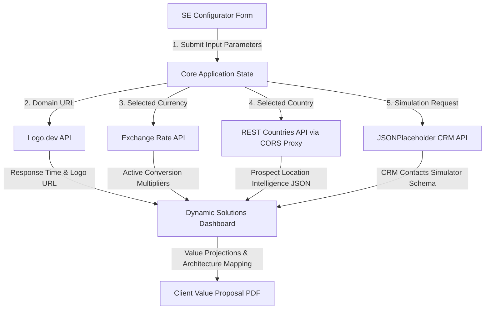

# DemoCraft ⚡ Enterprise ROI & Demo Configurator

[](https://democraft-se.vercel.app)

DemoCraft is a high-fidelity, interactive, and visually stunning web application designed specifically for a **Solutions Engineer (SE) / Presales & Go-To-Market (GTM)** portfolio. It demonstrates how a technical sales professional can bridge complex engineering concepts with high-value business outcomes.

Built with pure, production-ready **Vanilla HTML5, CSS3, and JavaScript (ES6)**, the application requires **zero compilation steps or npm package installs**, loading instantly directly from the local file system.

---

## 🌟 Why This Project Impresses in Solutions Engineering Interviews

Solutions Engineering lies at the intersection of **technical depth** and **commercial storytelling**. DemoCraft models the exact challenges a pre-sales engineer solves daily:

1. **Discovery & Custom Demos**: Dynamic vertical rebranding (FinTech, E-Commerce, Healthcare, SaaS) that updates theme assets, currencies, business pain points, and technical solutions on-the-fly.
2. **Value-Based Selling**: A live ROI calculator projecting time reclaimed, cost savings, payback timelines, and 3-year cumulative returns, allowing business buyers to see immediate financial impact.
3. **Data Enrichment & Personalization**: Live lookup of prospect brand marks using their website domain, turning a generic demo into a personalized workspace.
4. **Integration Engineering**: A sandbox exposing real REST API request/response JSON payloads, auth headers, and execution latency, proving to developers that you can "talk APIs."

---

## 🏗️ Technical Architecture



---

## 🔌 Real Public APIs Integrated (No Mocks)

| Service | API Endpoint | GTM Use Case | Technical Core |
| :--- | :--- | :--- | :--- |
| **Logo.dev API** | `https://img.logo.dev/{domain}?token={token}` | Prospect brand identification & customized UI personalization. | Client-side Image asset load profiling & CORS bypass. |
| **REST Countries** | `https://corsproxy.io/?https://restcountries.com/v3.1/name/{country}` | Location market intelligence, regional routing, and local compliance checks. | Secure CORS proxy tunnel with AllOrigins failover fallback. |
| **Exchange Rates** | `https://open.er-api.com/v6/latest/USD` | Global pricing adjustment, converting value matrices to prospects' local currencies. | Synchronized CORS-enabled endpoints, rate mapping, real-time math conversions. |
| **JSONPlaceholder** | `https://jsonplaceholder.typicode.com/users` | CRM Contacts integration preview, simulating active lead synchronization. | REST collection ingestion, dynamic HTML Table generation. |

---

## 🛠️ Key Product Features

*   **Responsive Glassmorphic UI**: Designed with a premium dark theme (`Plus Jakarta Sans` typography, backdrop blur filters, glowing border frames, custom scrollbars).
*   **Response Time Telemetry**: Displays the actual round-trip latency in milliseconds next to each API execution, showcasing technical depth.
*   **Dynamic Rebranding CSS Custom Variables**: Swapping target verticals adjusts core color schemes (emerald for FinTech, cyan for Healthcare, violet/pink for E-Commerce, blue/indigo for SaaS) and copy sets.
*   **Animated Counter Projections**: Value statistics count up from 0 to the calculated target dynamically using unified animation frame loops.
*   **Executive PDF Export**: Generates and compiles a complete business case proposal PDF dynamically in the browser (using client-side **jsPDF** modules) for stakeholders to download.

---

## 🚀 Running and Deploying Locally

### Option A: Local Execution (Zero Setup)
Simply double-click the `index.html` file to run it in any modern browser! It compiles without triggering local ES6 module CORS locks.

### Option B: Local Server (Recommended for Module Security)
To serve the files over a local loopback interface, execute any of the following command lines:

```bash
# Python 3
python3 -m http.server 8000

# Node.js (global tool)
npx serve .

# PHP
php -S localhost:8000
```
Then navigate to `http://localhost:8000` or `http://localhost:5000` inside your browser.

---

## 🌐 Free Production Hosting

### Host on Vercel (1-Minute Deploy)
1. Push this codebase directory to your GitHub account.
2. Visit [Vercel](https://vercel.com) and click **Add New Project**.
3. Import the GitHub repository and click **Deploy**. Vercel will identify it as a static site and deploy it instantly.
